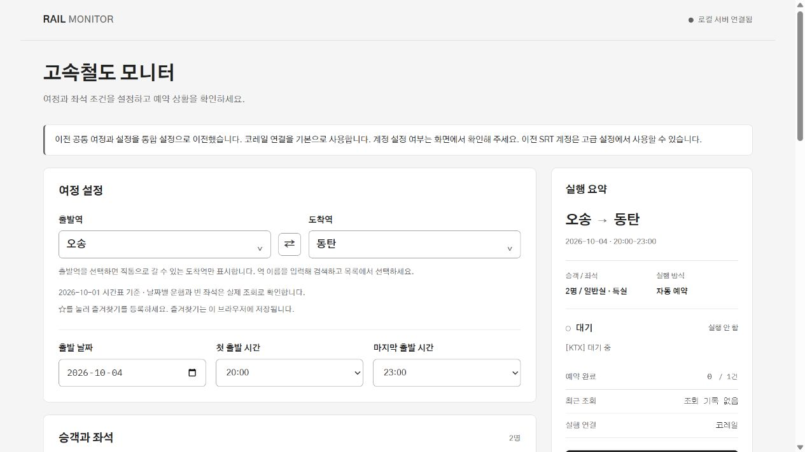

# Rail Monitor / 고속철도 통합 모니터

이 PC의 브라우저에서 하나의 여정과 계정을 설정해 고속철도 취소표를 감시하는 로컬 도구입니다. 기본 연결은 코레일 통합 계정(`korail`)이며 공식 앱 **코레일+**에서 예약 내역과 결제를 확인합니다. 고급 설정에서 이전 SRT 연결(`legacy_srt`)을 선택하면 별도 SRT 계정을 사용합니다. 감시 시작은 선택한 연결 하나만 실행하며 두 엔진을 동시에 자동 시작하지 않습니다.



## 주요 기능

- 출발·도착역, 날짜, 출발 시각 범위, 승객·좌석 조건으로 취소표 감시
- 빈 좌석 발견 시 텔레그램 알림, 선택 시 자동 예약(결제는 하지 않음)
- 공식 시간표 기반 직통 구간만 도착역으로 표시하는 검색형 역 선택기와 즐겨찾기
- 예약 결과를 확인할 수 없으면 `확인 필요`로 멈춰 중복 예약 방지
- 서버는 이 PC(루프백)에서만 접근 가능, 계정 정보는 화면에 다시 표시하지 않음

## 빠른 시작 (Windows)

```powershell
git clone <이 저장소 URL>
cd srt_monitor
.\install_web.bat   # 처음 한 번: .venv 생성과 의존성 설치
.\run_web.bat       # 서버 실행 후 http://127.0.0.1:8000/ 열기
```

> **주의** 이 프로젝트는 코레일·SR과 관계없는 개인 도구이며 비공식 API 라이브러리를 사용합니다. 철도사 이용약관을 확인하고 본인 책임으로 사용하세요. 계정 정보는 `web_config.json`에 평문 저장되며 이 파일은 저장소에 포함되지 않습니다.

설치·실행과 화면 사용 방법은 [WEB_README.md](WEB_README.md)를 참고하세요. Windows에서는 `install_web.bat`을 처음 한 번 실행한 뒤 `run_web.bat`을 실행하고 [http://127.0.0.1:8000/](http://127.0.0.1:8000/)에 접속합니다. Python 3.11 이상과 Git이 필요하며 별도 프론트 설치나 빌드는 필요하지 않습니다. 이 작업에서 확인한 환경은 프로젝트 `.venv`의 Python 3.12입니다.

## 구성

| 위치 | 역할 |
|---|---|
| `backend/app.py` | FastAPI API, 로컬 접근 제한, `/` 화면과 `/assets` 정적 파일 제공 |
| `frontend/` | HTML·CSS·JavaScript ES 모듈로 작성한 통합 화면·검색 역 선택기 |
| `backend/unified_monitor_service.py` | 선택한 연결의 시작·중지와 통합 상태 계산 |
| `backend/ktx_monitor_service.py`, `ktx_logic.py` | 코레일 연결의 조회·예약 처리. 파일명과 일부 이벤트의 KTX 명칭은 기존 호환용 |
| `backend/monitor_service.py`, `srt_logic.py` | 명시적으로 선택한 이전 SRT 연결 |
| `backend/reservation_coordinator.py` | 같은 서버 프로세스 내 예약 시도·불확실 결과·목표 수 조정 |
| `backend/schemas.py`, `config_store.py`, `stations.py` | 입력 검증, 설정 이전·저장, 정규 역명과 별칭 |
| `backend/routes.py`, `data/station_routes.json`, `tools/update_station_routes.py` | 공식 시간표 기반 직통 구간·재생성 도구. [출처와 갱신 방법](docs/architecture/station-route-sources.md) |
| `legacy_cli/` | 기존 SRT 전용 CLI(`srt_monitor.py`, `config.ini`/`config.py`, `build.bat`, `dist/srt_monitor.exe`). 웹 통합과 별개로 보존. `config.example.ini`를 `config.ini`로 복사해 값을 넣은 뒤 `python legacy_cli/srt_monitor.py`로 실행 |
| `tests/`, `docs/` | 테스트. 문서는 `architecture/`(구조·출처), `specs/`(설계), `plans/`(구현 계획), `verification/`(검증 기록) |

API는 루프백 클라이언트(`127.0.0.1`, `::1`, `localhost`)만 허용하며 실행 파일은 `127.0.0.1:8000`에만 서버를 엽니다. 출발역을 선택하면 공식 시간표에서 같은 열차가 정차하는 도착역만 표시합니다. 수원→동탄처럼 직통 고속열차가 없는 구간은 선택·저장·시작할 수 없습니다. 출발역이나 조회 연결을 바꿔 기존 도착역이 불가능해지면 도착역을 다시 선택해야 합니다. 선택한 날짜·시간의 실제 운행과 잔여석은 조회 결과로 확인합니다.

역 선택 드롭다운에서 역 이름을 검색하고 방향키·Enter로 선택할 수 있습니다. 역 옆의 별표로 즐겨찾기를 추가·해제하면 목록 상단에 표시합니다. 즐겨찾기는 이 브라우저에 저장되어 새로고침 후에도 유지하며, 도착 즐겨찾기에도 직통 구간 제한을 적용합니다.

## 설정 계약과 이전

공개 설정은 `schema_version: 2`, `connection_mode: "korail" | "legacy_srt"`와 단일 여정 필드를 사용합니다. 날짜는 실제 달력 날짜, 시각은 15분 단위의 시작·마지막 출발 시각, 승객 합계는 1~4명입니다. 일반실·특실 중 하나 이상을 선택해야 합니다. 승객 유형별 인원, 연석·같은 줄·같은 호차·창가 조건, 조회·생존 알림 주기, 자동 예약·목표 수·조건 불일치 처리 옵션을 화면에서 설정합니다. 감시 중에는 공개 설정과 계정을 변경할 수 없습니다.

버전 1 설정은 읽을 때 통합 계약으로 이전합니다. 기존 `monitor_ktx`가 켜져 있고 KTX 출발·도착역이 명시되어 있으면 해당 여정과 KTX 좌석종류를 승계하고, 그 외에는 기존 공통 여정과 좌석종류를 사용합니다. 승객·좌석 배치·알림·예약 옵션과 저장된 비밀 정보는 유지합니다. 연결은 코레일로 이전되며 기존 코레일 계정이 저장되어 있다면 유지하여 사용합니다. 이전 SRT 계정은 코레일 계정으로 변환하지 않고 고급 연결에서 사용합니다. 버전 2의 여정은 남아 있는 구형 KTX 필드가 덮어쓰지 않습니다. 잘못된 구형 역명 `사천`은 같은 역 코드의 `여천`으로 바로잡습니다.

첫 쓰기 전에 기존 파일 원본을 `web_config.json.v1.bak`으로 한 번 백업하고, 완성한 임시 파일을 교체해 설정을 저장합니다. 과거 출발 날짜를 읽으면 내일 날짜로 조정하므로 화면의 여정을 확인한 뒤 저장하세요. 계정 입력의 빈칸은 기존 값을 유지하며 값을 삭제하는 명령이 아닙니다. 비밀 값은 성공적으로 저장된 입력만 화면에서 비웁니다. 공개 API는 비밀 값을 반환하지 않고 계정 API는 설정 여부만 반환합니다.

`web_config.json`과 이전 백업에는 계정·비밀번호·텔레그램 토큰이 **평문**으로 저장됩니다. 폴더나 백업을 공유할 때 함께 전달하지 마세요. 기존 CLI의 `legacy_cli/config.ini`도 별도로 보호해야 합니다. `.gitignore`는 이 파일들, 로그, 가상환경과 검증 산출물을 제외합니다.

## 조회와 예약

**알림만 받기**는 좌석 발견 이벤트와 설정된 텔레그램 알림을 보내며 예약하지 않습니다. 장애인 운임 인원이 포함된 코레일 자동 예약은 현재 지원하지 않아 시작을 거부합니다. 이 경우 알림만 받기를 선택하고 공식 앱에서 직접 예약하세요.

**자동 예약**은 예약을 시도하지만 결제를 완료하지 않습니다. 예약 후 코레일+ 또는 해당 공식 서비스에서 결제 기한과 실제 좌석을 확인해야 합니다. 필수 좌석 조건의 불일치가 확인되면 설정에 따라 자동 취소할 수 있습니다. 반면 예약 응답·예약번호·필수 좌석 위치를 확인할 수 없으면 결과를 `UNCERTAIN`으로 처리하고 추가 예약을 막습니다. 설치된 `KorailReservation`은 인원 수가 있어도 개별 좌석 위치가 없을 수 있습니다. 이때 연석·같은 줄·같은 호차·필수 창가 조건은 검증할 수 없으므로 예약을 유지한 채 **확인 필요**를 표시하며 자동 취소하지 않습니다.

확인 필요 상태에서는 코레일+(이전 SRT 연결은 SRT)에서 예약 유무와 좌석을 직접 확인한 뒤 화면의 실제 결과에 맞는 예약 확인 버튼을 누르세요. 버튼은 프로그램의 예약 잠금·계수만 정리하며 철도사 예약을 조회하거나 취소하지 않습니다.

예약 조정자의 잠금과 예약 수는 **프로세스 메모리**에 있습니다. 서버를 재시작하면 사라지고 새 감시 세션은 조건에 따라 예약 수를 새로 계산합니다. 서버 재시작이나 새 감시 시작 전에 공식 앱에서 기존 예약을 확인하세요. 재시작 후에도 중복 예약 방지가 유지된다는 보장은 없습니다. 브라우저 새로고침은 서버 재시작과 다릅니다.

## API와 개발 확인

| 경로 | 역할 |
|---|---|
| `GET/POST /api/config/public` | 비밀 정보 제외 설정 조회·저장 |
| `GET/POST /api/config/secrets` | 비밀 정보 설정 여부 조회·비어 있지 않은 값 저장 |
| `POST /api/start`, `/api/stop` | 선택한 연결의 감시 시작·중지 |
| `GET /api/status` | 통합 단계, 최근 조회, 예약 수와 예약 잠금 |
| `GET /api/stations`, `/api/stations/srt`, `/api/stations/ktx` | 역 목록. `ktx` 경로는 호환용 명칭 |
| `GET /api/station-routes` | 역 목록, 조회 연결별 출발→도착 후보, 공식 시간표 출처·기준일 |
| `GET /api/events`, `/api/events/stream` | 최근 이벤트와 SSE 실시간 이벤트 |
| `POST /api/reservation-lock/resolve` | 사람이 확인한 예약 유무(`found`)를 반영 |

상태·이벤트의 `srt`, `ktx`, `uncertain_service` 값은 기존 API 호환용으로 유지됩니다. `connection_mode`와 통합 단계가 현재 선택한 연결과 상태를 나타냅니다. SSE 연결 상태와 최근 성공 조회 시각은 별개입니다.

```powershell
.\.venv\Scripts\python.exe -m pip install -r requirements-dev.txt
.\.venv\Scripts\python.exe -m pytest -q
```

현재 기능 검증은 임시 설정과 모의 철도사 응답을 사용한 273개 테스트 통과(서버 269개, 프론트 규칙·초점 4개)와 데스크톱·모바일 브라우저 확인을 기준으로 합니다. [역 선택 검증 기록](docs/verification/2026-10-03-station-picker.md)을 참고하세요. 실제 계정의 코레일 통합 API 로그인·조회·예약과 실제 텔레그램 전송은 검증하지 않았습니다. `requirements-web.txt`는 프로젝트에서 사용하던 korail2 포크의 확인한 커밋을 고정합니다. 설치·모의 테스트 성공이 실제 철도사 API의 이용 가능성을 보장하지 않습니다.
