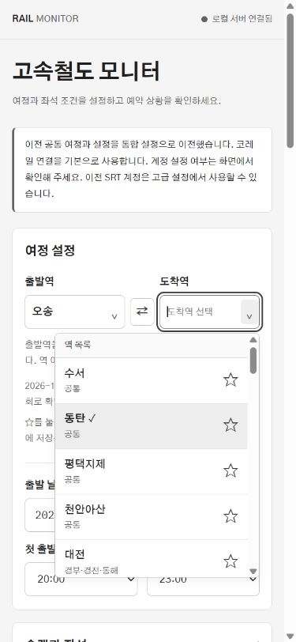

# 모노톤 UI 검증

2026-10-03, 실제 로컬 화면 `http://127.0.0.1:8000/`에서 확인했다.

- 흰색 카드, 회색 테두리, 검정 텍스트와 주요 버튼으로 화면을 정리했다. 큰 장식, 그라데이션, 점멸 애니메이션을 제거했다.
- HTML의 고유 ID 100개와 앱에서 참조하는 요소 56개가 유지된다. 기능 JavaScript와 백엔드는 변경하지 않았다.
- 데스크톱과 390 × 844 모바일 화면에서 가로 넘침이 없음을 확인했다. 모바일 역 목록과 고급 설정도 정상 표시된다.
- 도착역 검색, 선택 표시, 즐겨찾기 등록·해제, 키보드 이동 및 Escape 닫기를 확인했다. 임시 즐겨찾기 변경은 복원했다.
- 브라우저 콘솔 오류가 없었다. 실제 설정 저장이나 감시·예약은 실행하지 않았다.
- 구현 후 별도 서브에이전트의 요구사항 및 품질 검토를 통과했다.

