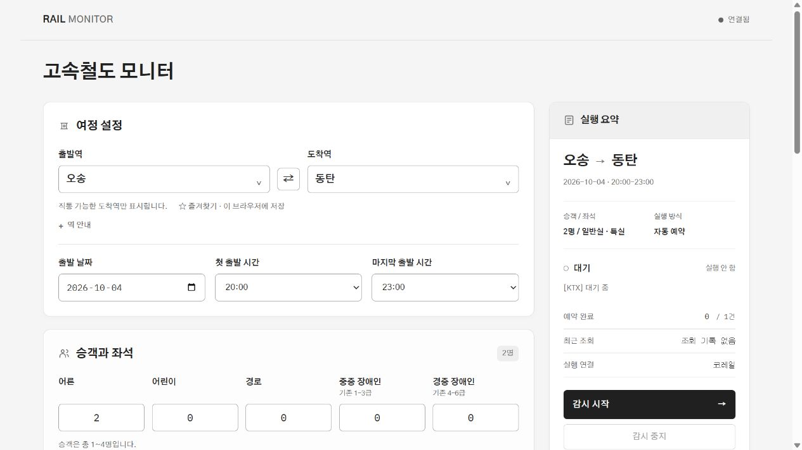
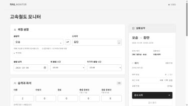

# 화면 미세 조정 검증

실제 로컬 화면에서 2026-10-03 확인했다.

- 소개 문장과 설정 이전 배너가 표시되지 않는다. 배너 요소와 렌더링 호출을 함께 제거했다.
- 작은 아이콘, 부드러운 카드 경계, 밝은 표면 차이와 요약 헤더가 적용됐다.
- 역 안내는 펼칠 때 시간표 출처를 표시한다. 정상 연결·저장·계정 상태와 기록 안내가 짧아졌다.
- 데스크톱과 390 × 844 모바일 화면 모두 가로 넘침이 없다. 모바일 도착역 팝업은 화면 안에 표시된다.
- 도착역 검색, 선택 표시, Escape 닫기를 확인했다. 계정 입력·설정 저장·감시 시작은 실행하지 않았다.
- 정적 앱 요소 참조 56개, HTML 접근성 참조 모두 유효하며 ID 99개가 고유하다. JavaScript 문법 검사와 별도 서브에이전트의 요구사항·품질 검토를 통과했다.
- 브라우저 콘솔 오류가 없고 임시 모바일 화면 크기를 복원했다.

